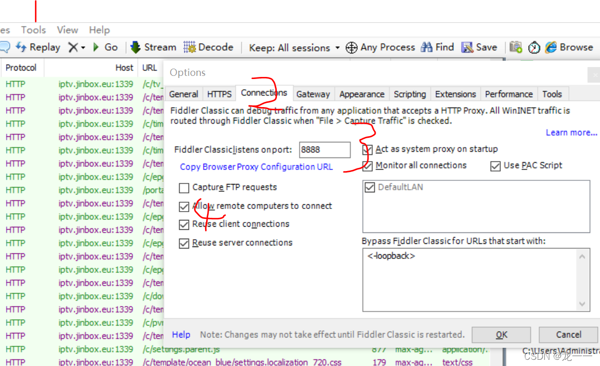
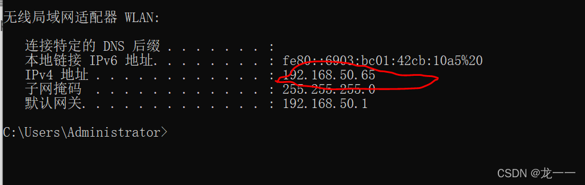
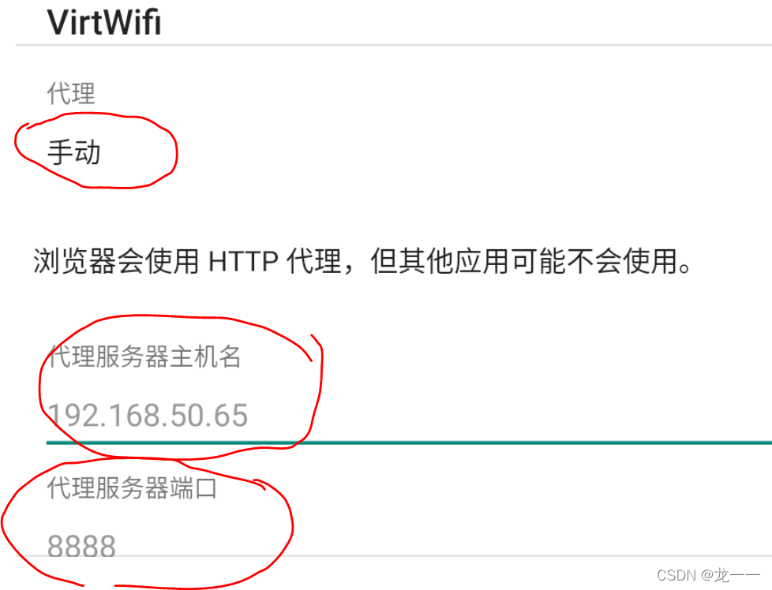
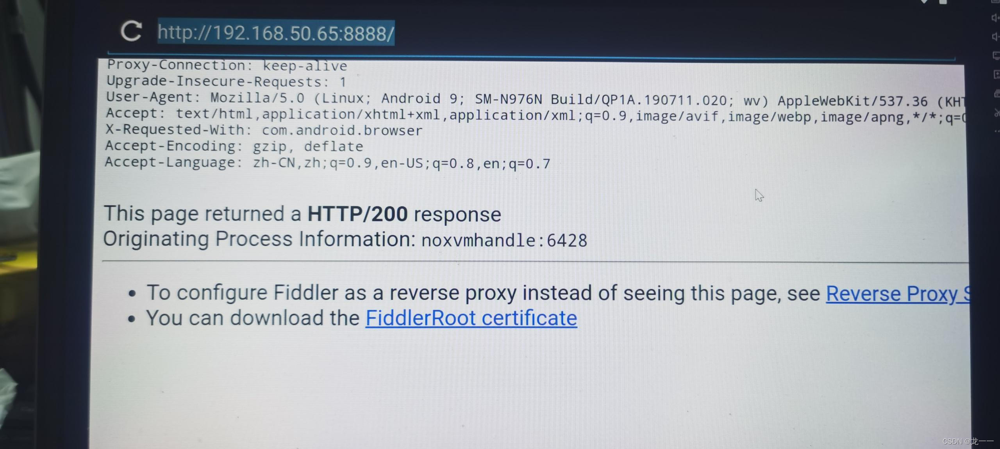
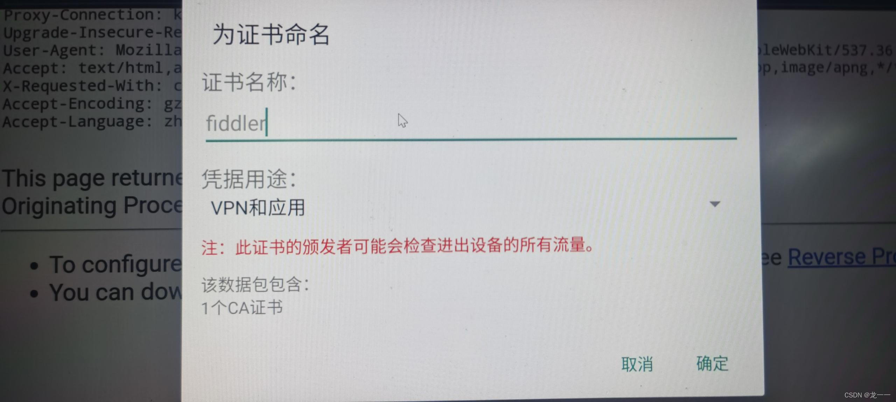

# fiddler +逍遥模拟器 ，添加代理后抓包 app数据

- 安装fiddler
- 安装夜神模拟器
- 将apk安装在夜神模拟器上
- fiddler设置
tools-->Options--->Conneions-->Fiddler Classiclistens onport  设置成8888

- 夜神模拟器设置代理
	1.查看本机的ip

 2.代理设置
     代理： 手动
     代理服务器主机名： 上一步查看的 ip
     代理端口： 8888 （跟fiddler上的设置一样）

3. 夜神模拟器安装 fiddler证书
   a. 打开浏览器
   b.输入代理服务器和代理端口
    192.168.50.65:8888
 

   c.证书安装完后，输入一个网址，能正常上网就可以了